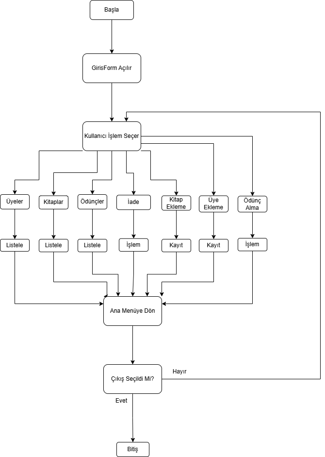

# Kutuphane Otomasyon Sistemi

## PROBLEM TANIMI

Geleneksel kütüphane sistemlerinde kitapların takibi, üyelerin ödünç aldığı kitapların kontrolü ve iade süreçleri manuel olarak yapılmaktadır. Bu durum; veri kaybına, kitapların yanlış takip edilmesine, ödünç/iade işlemlerinde karışıklığaneden olmaktadır.
Bu proje kapsamında, kütüphane işlemlerinin dijital ortamda yönetilmesini sağlayan bir otomasyon sistemi geliştirilmiştir. 
Amaç; kitap, üye ve ödünç işlemlerini merkezi bir veritabanı üzerinden yönetmektir.

## YAPILAN ARAŞTIRMALAR
#### Proje geliştirme sürecinde aşağıdaki konular araştırılmıştır:
  - Microsoft SQL Server veritabanı tasarımı
  - C# WinForms ile veritabanı bağlantısı (ADO.NET)
  - Trigger kullanımı ile otomatik veri güncelleme
  - View yapıları ile raporlama sistemleri
  - Foreign Key ilişkileri ve normalizasyon kuralları
  - Get or Creat yaklaşımı
## Karşılaşılan sorunlar ve çözümler:
  - Veri tutarlılığı sorunu: Trigger kullanılarak çözüldü.
  - SQL sorgu karmaşıklığı: View yapıları ile sadeleştirildi.
  - İlişkisel veri yönetimi: Foreign key yapıları ile düzenlendi.
  - Tekrar eden kayılar: Get or creat yaklaşımı ile engellendi.

## Akış Şeması

## YAZILIM MİMARİSİ

Proje 3 katmanlı basit mimari ile geliştirilmiştir:
### 1. Sunum Katmanı (UI)
  - **C# WinForms formları:**  
       UyelerForm, KitaplarForm, OduncVerForm, OduncListesiForm, UyeEklemeForm, IadeEtmeForm, KitapEkleForm
### 2. İş Katmanı (Logic)
  - Ödünç verme kuralları
  - Veri doğrulama işlemleri
  - Trigger ve procedure kullanımı
### 3. Veri Katmanı (Database)
  - Microsoft SQL Server
  - **Tablolar:** 
      uyeler, yayınevleri, kategoriler, kitap_kategorileri, kitaplar, yazarlar, kitap_kopyalari, odunc_almalar
    
## VERİTABANI DİYAGRAMI (ER MODELİ)

## GENEL YAPI

Proje şu modüllerden oluşmaktadır:
  - Üye Yönetimi (ekleme, listeleme)
  - Kitap Yönetimi (ekleme, listeleme)
  - Ödünç İşlemleri
  - Ödünç Raporlama
  - İade İşlemleri

Sistem, SQL Server veritabanı ile entegre olarak geliştirilmiştir. Üye, kitap, ödünç ve iade işlemleri kullanıcı arayüzü üzerinden yönetilmekte, tüm veriler veritabanında güvenli ve tutarlı bir şekilde saklanmaktadır. Ayrıca veritabanı üzerinde sorgulama, ekleme, güncelleme ve silme işlemleri de gerçekleştirilebilmektedir.

## REFERANSLAR
#### Proje geliştirme sürecinde kullanılan kaynaklar:
  - Microsoft Learn – SQL Server Documentation
      https://learn.microsoft.com/sql/
  - C# ADO.NET Guide
      https://learn.microsoft.com/dotnet/framework/data/adonet/
  - W3Schools 
      https://www.w3schools.com
  - Geeksforgeeks
      https://www.geeksforgeeks.org/

